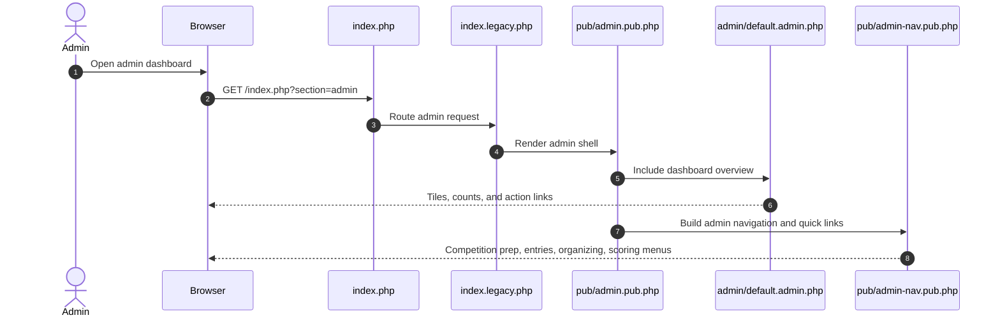

# Admin Dashboard and Navigation

Source notes:
- [index.legacy.php](https://github.com/geoffhumphrey/brewcompetitiononlineentry/index.legacy.php) routes `section=admin` requests by `go` and `action`.
- [pub/admin.pub.php](https://github.com/geoffhumphrey/brewcompetitiononlineentry/pub/admin.pub.php) renders the admin shell and module includes.
- [pub/admin-nav.pub.php](https://github.com/geoffhumphrey/brewcompetitiononlineentry/pub/admin-nav.pub.php) contains the admin menu and quick links.
- [admin/default.admin.php](https://github.com/geoffhumphrey/brewcompetitiononlineentry/admin/default.admin.php) is the dashboard landing page.

---

**Navigation:** [← Admin Journeys](admin-journeys.md) | [Prep & Records](admin-prep-and-records.md) | [Entries, Scoring & Output](admin-entries-scoring-output.md)
