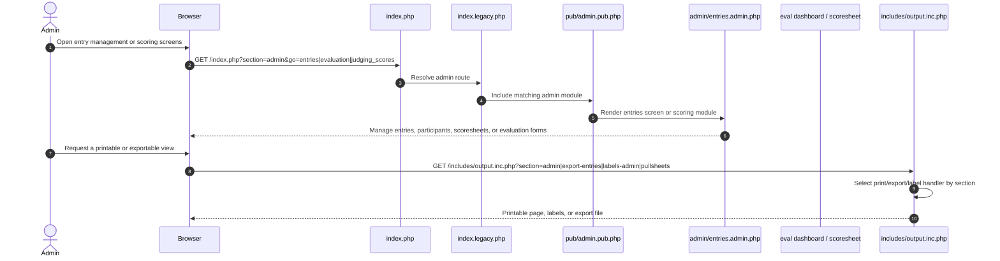

# Admin Entries, Scoring, and Output

Source notes:
- [index.legacy.php](https://github.com/geoffhumphrey/(brewcompetitiononlineentry/index.legacy.php) routes `entries`, `evaluation`, and scoring-related `go` values.
- [admin/entries.admin.php](https://github.com/geoffhumphrey/brewcompetitiononlineentry/admin/entries.admin.php) covers entry management and print links.
- [pub/electronic_scoresheets.pub.php](https://github.com/geoffhumphrey/brewcompetitiononlineentry/pub/electronic_scoresheets.pub.php) and [eval/scoresheet.eval.php](https://github.com/geoffhumphrey/brewcompetitiononlineentry/eval/scoresheet.eval.php) handle evaluation routes.

---

**Navigation:** [← Admin Journeys](admin-journeys.md) | [Dashboard & Nav](admin-dashboard-and-nav.md) | [Prep & Records](admin-prep-and-records.md)
- [includes/output.inc.php](https://github.com/geoffhumphrey/brewcompetitiononlineentry/includes/output.inc.php) routes print/export/label output.