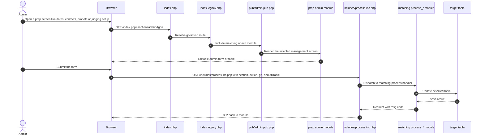

# Admin Prep and Records

Source notes:
- [index.legacy.php](https://github.com/geoffhumphrey/brewcompetitiononlineentry/index.legacy.php) dispatches prep screens such as dates, contacts, judging, dropoff, and preferences.
- [pub/admin.pub.php](https://github.com/geoffhumphrey/brewcompetitiononlineentry/pub/admin.pub.php) includes the selected admin module.
- [includes/process.inc.php](https://github.com/geoffhumphrey/brewcompetitiononlineentry/includes/process.inc.php) dispatches POST saves to the matching process module.
- [admin/competition_info.admin.php](https://github.com/geoffhumphrey/brewcompetitiononlineentry/admin/competition_info.admin.php), [admin/contacts.admin.php]((https://github.com/geoffhumphrey/brewcompetitiononlineentry/admin/contacts.admin.php), and [admin/dropoff.admin.php](https://github.com/geoffhumphrey/brewcompetitiononlineentry/admin/dropoff.admin.php) are representative prep screens.

---

**Navigation:** [← Admin Journeys](admin-journeys.md) | [Dashboard & Nav](admin-dashboard-and-nav.md) | [Entries, Scoring & Output](admin-entries-scoring-output.md)
