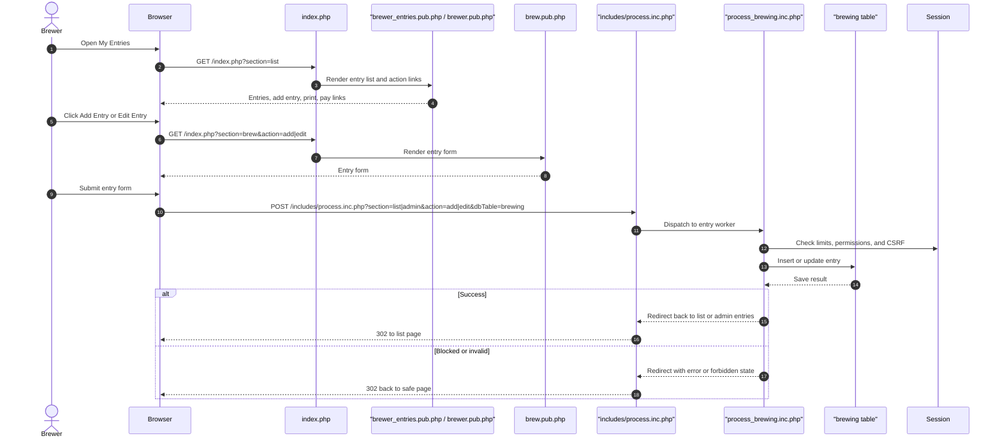

# Entries and Add/Edit Flow

Source notes:
- [sections/brewer_entries.sec.php](https://github.com/geoffhumphrey/brewcompetitiononlineentry/sections/brewer_entries.sec.php) drives the public entries list and action links.
- [sections/brew.sec.php](https://github.com/geoffhumphrey/brewcompetitiononlineentry/sections/brew.sec.php) renders the add/edit entry form.
- [includes/process.inc.php](https://github.com/geoffhumphrey/brewcompetitiononlineentry/includes/process.inc.php) routes entry submits by `section`, `action`, and `dbTable`.

---

**Navigation:** [← Overview](public-user-journeys.md) | [Route Selection](public-route-selection.md) | [Registration](registration.md) | [Login & Recovery](login-and-recovery.md) | [Judge Journeys](judge-journeys.md) | [Admin Journeys](admin-journeys.md)
- [includes/process/process_brewing.inc.php](https://github.com/geoffhumphrey/brewcompetitiononlineentry/includes/process/process_brewing.inc.php) enforces limits and writes the brewing record.