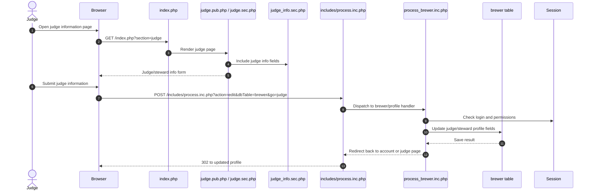
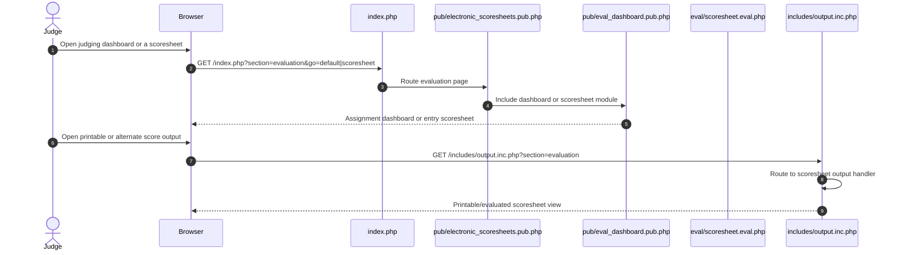
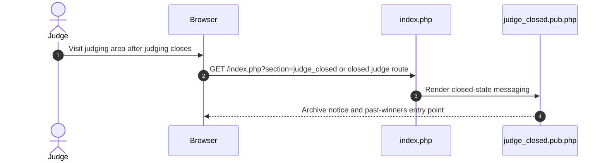

# Judge Journeys

## Judge profile setup and update

## Judging dashboard and scoresheets

## Closed judging state

Source notes:
- [pub/judge.pub.php](brewcompetitiononlineentry/pub/judge.pub.php) contains the judge information form and submit target.
- [sections/judge.sec.php](https://github.com/geoffhumphrey/brewcompetitiononlineentry/sections/judge.sec.php) shows the judge info fields and session-backed form data.
- [sections/judge_info.sec.php](https://github.com/geoffhumphrey/brewcompetitiononlineentry/sections/judge_info.sec.php) is the included judge info section.
- [pub/judge_closed.pub.php](brewcompetitiononlineentry/pub/judge_closed.pub.php) shows the post-judging closed-state experience.
- [includes/process.inc.php](https://github.com/geoffhumphrey/brewcompetitiononlineentry/includes/process.inc.php) routes `action=edit` updates for `dbTable=brewer`.
- [pub/electronic_scoresheets.pub.php](https://github.com/geoffhumphrey/brewcompetitiononlineentry/pub/electronic_scoresheets.pub.php) routes evaluation dashboard and scoresheet views.
- [eval/scoresheet.eval.php](https://github.com/geoffhumphrey/brewcompetitiononlineentry/eval/scoresheet.eval.php) controls the judging scoresheet state and source data.

---

**Navigation:** [← Overview](public-user-journeys.md) | [Route Selection](public-route-selection.md) | [Registration](registration.md) | [Login & Recovery](login-and-recovery.md) | [Entries](entries-and-add-edit-flow.md) | [Admin Journeys](admin-journeys.md)
- [includes/output.inc.php](https://github.com/geoffhumphrey/brewcompetitiononlineentry/includes/output.inc.php) routes printable evaluation output.