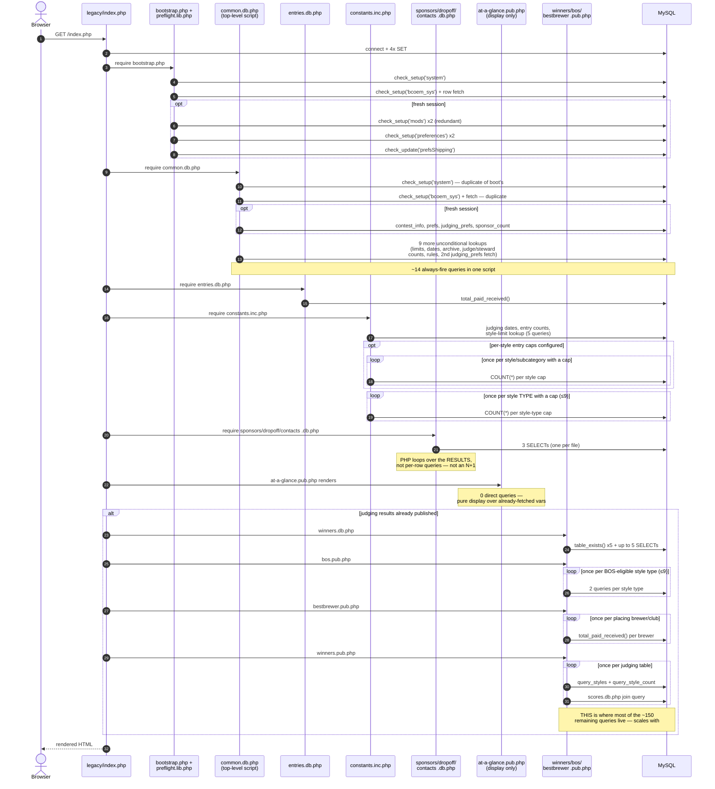
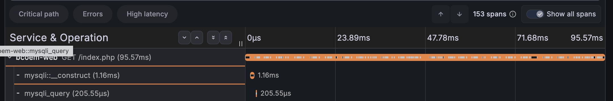

**Key finding:** the fixed, always-fires floor is ~40 queries (config connect, preflight, `common.db.php's` top-level script, entries/constants baseline lookups, sponsors/dropoff/contacts). The rest of the ~194 is almost entirely explained by **N+1 loops in the judging-results rendering path** (winners.pub.php, bos.pub.php, bestbrewer.pub.php) — one or more queries per judging table, per style type, and per placing brewer/club. On an install with active results, that's the dominant multiplier, not the baseline.

