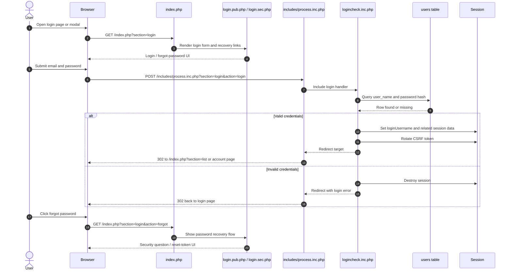

# Login and Recovery

Source notes:
- [sections/login.sec.php](https://github.com/geoffhumphrey/brewcompetitiononlineentry/sections/login.sec.php) contains the public login and recovery forms.
- [pub/login.pub.php](https://github.com/geoffhumphrey/brewcompetitiononlineentry/pub/login.pub.php) renders the public login page and reset-token flow.
- [includes/process.inc.php](https://github.com/geoffhumphrey/brewcompetitiononlineentry/includes/process.inc.php) dispatches login/logout/forgot actions.
- [includes/logincheck.inc.php](https://github.com/geoffhumphrey/brewcompetitiononlineentry/includes/logincheck.inc.php) checks credentials and sets the session.

---

**Navigation:** [← Overview](public-user-journeys.md) | [Route Selection](public-route-selection.md) | [Registration](registration.md) | [Entries](entries-and-add-edit-flow.md) | [Judge Journeys](judge-journeys.md) | [Admin Journeys](admin-journeys.md)
