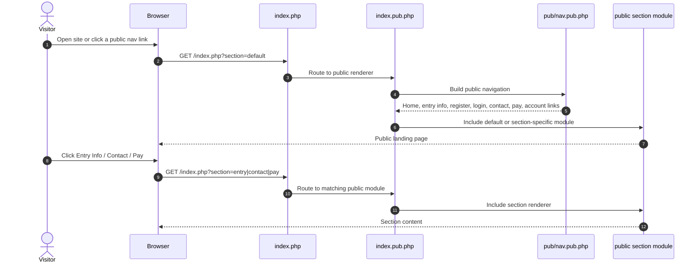

# Public Route Selection

Source notes:
- [index.php](index.php) routes requests by `section` to `index.pub.php`.
- [index.pub.php](https://github.com/geoffhumphrey/brewcompetitiononlineentry/index.pub.php) renders the public shell and includes the current public section module.
- [pub/nav.pub.php](https://github.com/geoffhumphrey/brewcompetitiononlineentry/pub/nav.pub.php) builds the public navigation and route-aware links.
- [includes/url_variables.inc.php](https://github.com/geoffhumphrey/brewcompetitiononlineentry/includes/url_variables.inc.php) defines the request vars used by the router.

---

**Navigation:** [← Overview](public-user-journeys.md) | [Registration](registration.md) | [Login & Recovery](login-and-recovery.md) | [Entries](entries-and-add-edit-flow.md) | [Judge Journeys](judge-journeys.md) | [Admin Journeys](admin-journeys.md)
