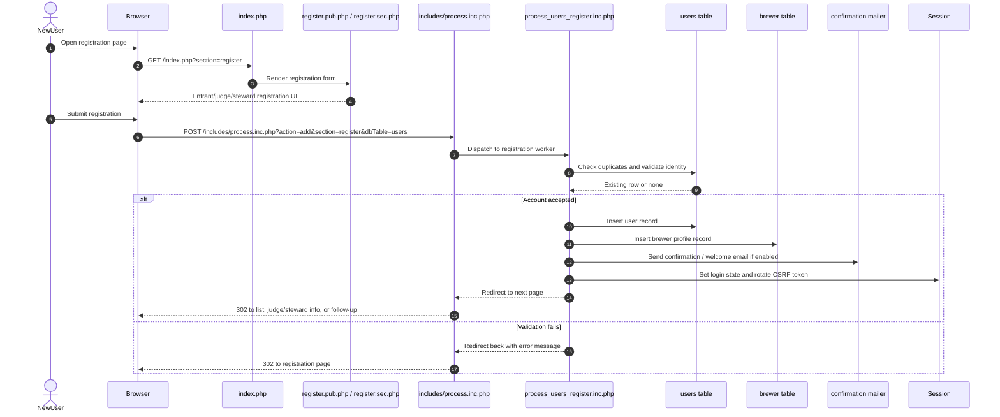

# Registration

Source notes:
- [sections/register.sec.php](sections/register.sec.php) defines the public registration form and window-based options.
- [pub/register.pub.php](pub/register.pub.php) renders the public registration screen.
- [includes/process.inc.php](includes/process.inc.php) dispatches `action=add` for registration submits.
- [includes/process/process_users_register.inc.php](includes/process/process_users_register.inc.php) performs duplicate checks, inserts, and redirect selection.

---

**Navigation:** [← Overview](public-user-journeys.md) | [Route Selection](public-route-selection.md) | [Login & Recovery](login-and-recovery.md) | [Entries](entries-and-add-edit-flow.md) | [Judge Journeys](judge-journeys.md) | [Admin Journeys](admin-journeys.md)
