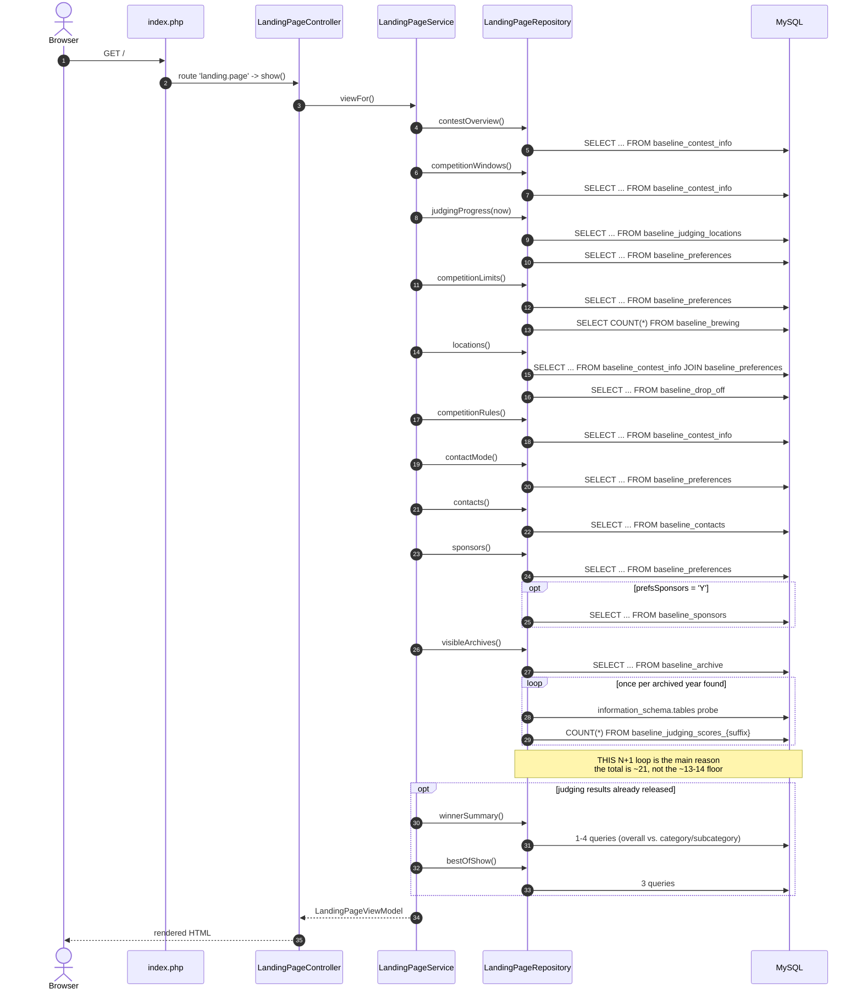
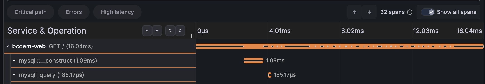

## Modern Landing Page

```mermaid
sequenceDiagram
    autonumber
    actor Browser
    participant idx as index.php
    participant ctrl as LandingPageController
    participant svc as LandingPageService
    participant repo as LandingPageRepository
    participant DB as MySQL

    Browser->>idx: GET /
    idx->>ctrl: route 'landing.page' -> show()
    ctrl->>svc: viewFor()

    svc->>repo: contestOverview()
    repo->>DB: SELECT ... FROM baseline_contest_info

    svc->>repo: competitionWindows()
    repo->>DB: SELECT ... FROM baseline_contest_info

    svc->>repo: judgingProgress(now)
    repo->>DB: SELECT ... FROM baseline_judging_locations
    repo->>DB: SELECT ... FROM baseline_preferences

    svc->>repo: competitionLimits()
    repo->>DB: SELECT ... FROM baseline_preferences
    repo->>DB: SELECT COUNT(*) FROM baseline_brewing

    svc->>repo: locations()
    repo->>DB: SELECT ... FROM baseline_contest_info JOIN baseline_preferences
    repo->>DB: SELECT ... FROM baseline_drop_off

    svc->>repo: competitionRules()
    repo->>DB: SELECT ... FROM baseline_contest_info

    svc->>repo: contactMode()
    repo->>DB: SELECT ... FROM baseline_preferences

    svc->>repo: contacts()
    repo->>DB: SELECT ... FROM baseline_contacts

    svc->>repo: sponsors()
    repo->>DB: SELECT ... FROM baseline_preferences
    opt prefsSponsors = 'Y'
        repo->>DB: SELECT ... FROM baseline_sponsors
    end

    svc->>repo: visibleArchives()
    repo->>DB: SELECT ... FROM baseline_archive
    loop once per archived year found
        repo->>DB: information_schema.tables probe
        repo->>DB: COUNT(*) FROM baseline_judging_scores_{suffix}
    end
    Note over repo,DB: THIS N+1 loop is the main reason<br/>the total is ~21, not the ~13-14 floor

    opt judging results already released
        svc->>repo: winnerSummary()
        repo->>DB: 1-4 queries (overall vs. category/subcategory)
        svc->>repo: bestOfShow()
        repo->>DB: 3 queries
    end

    svc-->>ctrl: LandingPageViewModel
    ctrl-->>Browser: rendered HTML
```
    **Note over repo,DB:** baseline_contest_info hit by 4 separate methods baseline_preferences hit by 5 separate methods — each a single-row id=1 lookup, never shared

